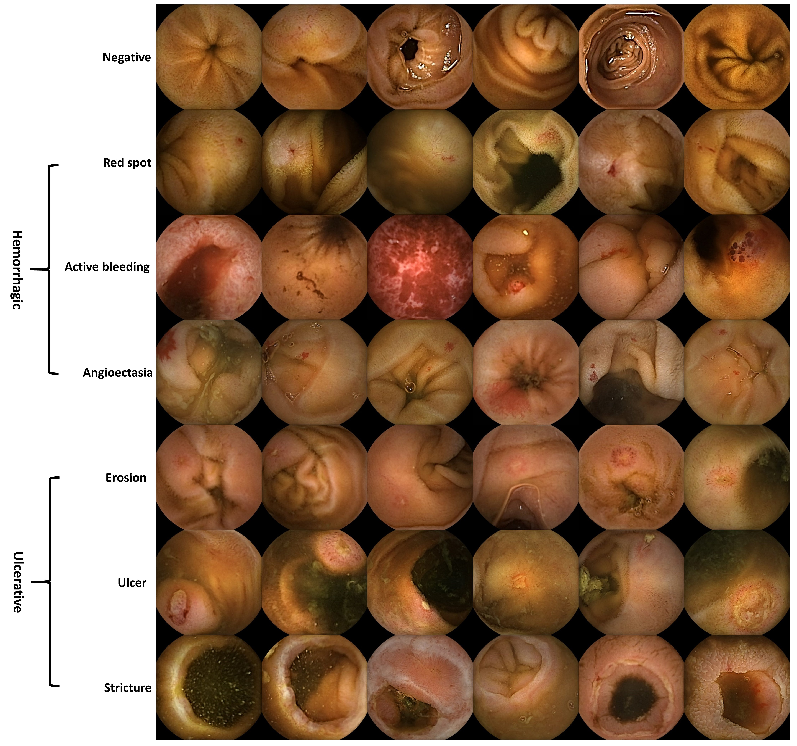
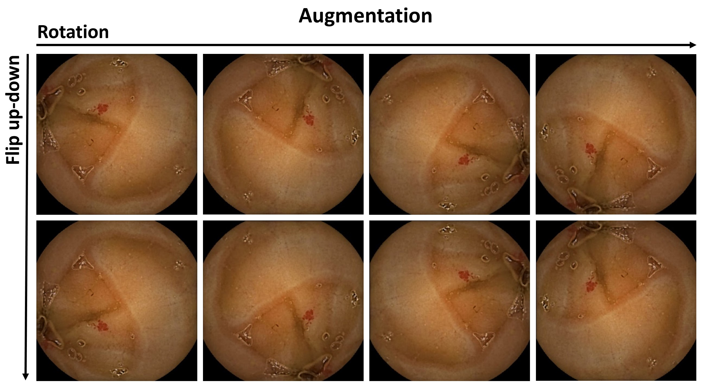
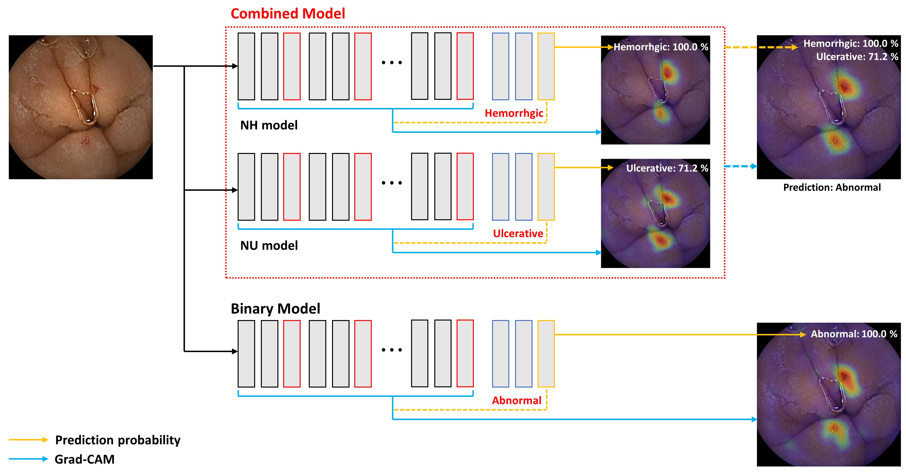
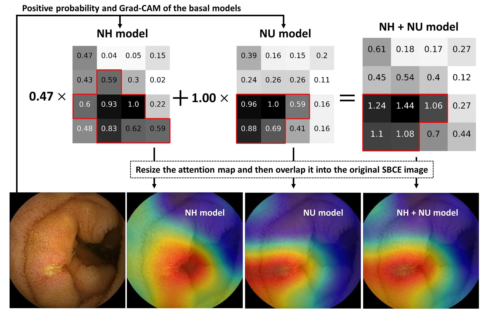
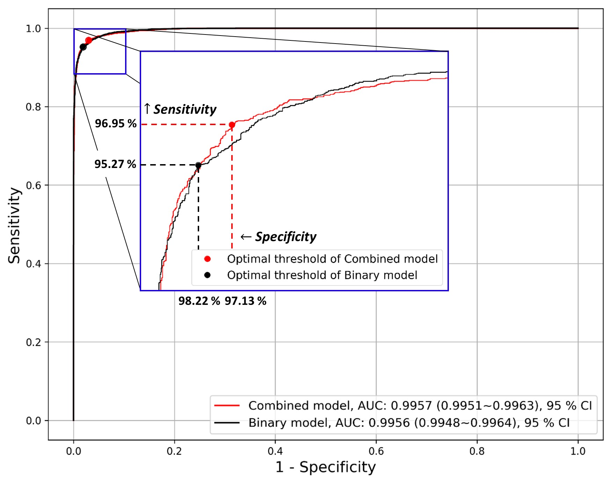
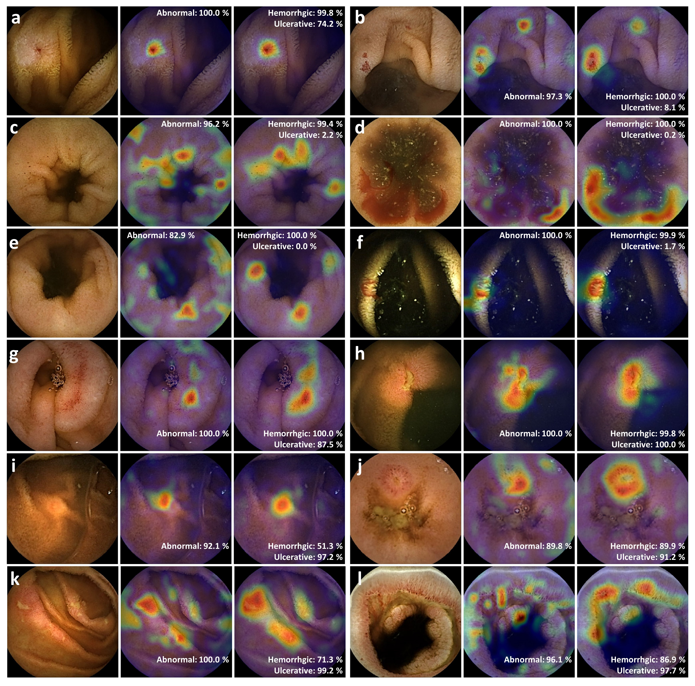
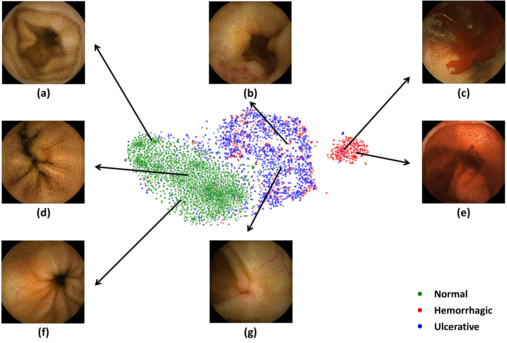

# CapsuleEndo_v1-tensorflow

CNN-based classification and XAI-based localization

Automate lesion localization using Grad-CAM as XAI, which is also known as weakly-supervised object localization 

Hwang, Yunseob, et al. "Improved classification and localization approach to small bowel capsule endoscopy using convolutional neural network." Digestive Endoscopy (2020).

## Small Bowel Capsule Endocsopy Images by Small Bowel Lesions

## Data Preprocessing and Augmentation

     <b> Preprocessing for SBCE images</b>  
     

 

     <b> Flip and Rotation Augmentation</b>  
     

 

## Network Fusion

- To boost sensitivity
- To achieve better localization ability through a visual explanation for AI's decision >> Make it more reliable 

### Method

     <b> Network Fusion on Decision Level</b>  
     

 

     <b> Probability-based CAM Fusion </b>  
     

 

### Results

     <b> ROC curves</b>  
     

 

     <b> Localization Ability Comparison (Reliability of Decision)</b>  
     

 

     <b> Feature Visualization using t-SNE</b>  
     

 
