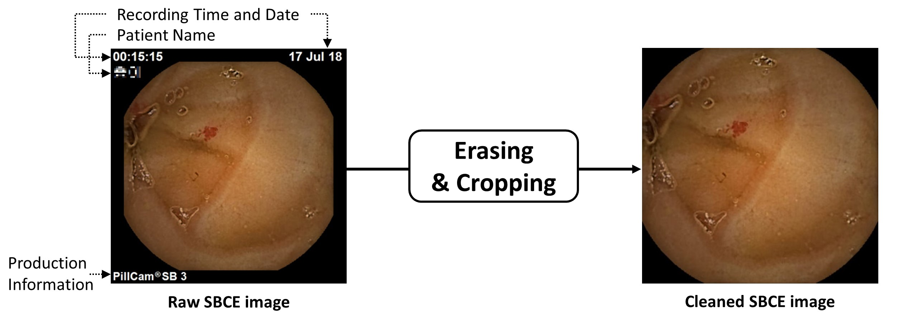

# CapsuleEndo_v1-tensorflow

CNN-based classification and XAI-based localization

Automate lesion localization using Grad-CAM as XAI, which is also known as weakly-supervised object localization 

Hwang, Yunseob, et al. "Improved classification and localization approach to small bowel capsule endoscopy using convolutional neural network." Digestive Endoscopy (2020).

## Small Bowel Capsule Endocsopy Images by Small Bowel Lesions

## Data Preprocessing and Augmentation

## Network Fusion

- To boost sensitivity
- To enable AI (CNN) localization ability using CAM 

### Method

### Results

{: width="100" height="100"}

